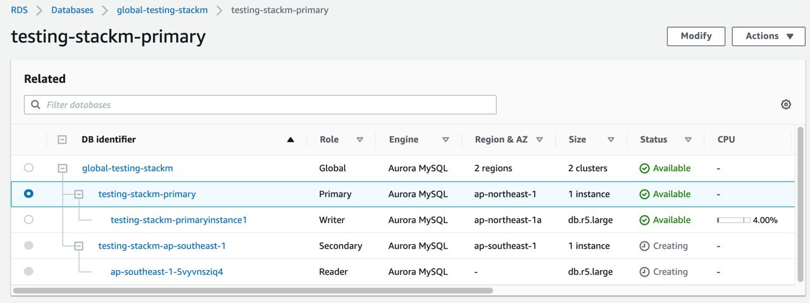

[](https://badge.fury.io/js/cdk-aurora-globaldatabase)
[](https://badge.fury.io/py/cdk-aurora-globaldatabase)


# cdk-aurora-globaldatabase
`cdk-aurora-globaldatabase` is an AWS CDK construct library that allows you to create [Amazon Aurora Global Databases](https://aws.amazon.com/rds/aurora/global-database/) with AWS CDK in Typescript or Python.

# Why
**Amazon Aurora Global Databases** is designed for multi-regional Amazon Aurora Database clusters that span across different AWS regions. Due to the lack of native cloudformation support, it has been very challenging to build with cloudformation or AWS CDK with the upstream `aws-rds` construct.

`cdk-aurora-globaldatabase` aims to offload the heavy-lifting and helps you provision and deploy cross-regional **Amazon Aurora Global Databases** simply with just a few CDK statements.

## Install
```bash
Use the npm dist tag to opt in CDKv1 or CDKv2:

// for CDKv2
npm install cdk-aurora-globaldatabase
or
npm install cdk-aurora-globaldatabase@latest

// for CDKv1
npm install cdk-aurora-globaldatabase@cdkv1
```


## Now Try It !!!
# Sample for Mysql 
```ts
import { GlobalAuroraRDSMaster, InstanceTypeEnum, GlobalAuroraRDSSlaveInfra } from 'cdk-aurora-globaldatabase';
import { App, Stack, CfnOutput } from '@aws-cdk/core';
import * as ec2 from '@aws-cdk/aws-ec2';
// new app .
const mockApp = new App();

// setting two region env config .
const envSingapro  = { account: process.env.CDK_DEFAULT_ACCOUNT, region: 'ap-southeast-1' };
const envTokyo = { account: process.env.CDK_DEFAULT_ACCOUNT, region: 'ap-northeast-1' };

// create stack main .
const stackM = new Stack(mockApp, 'testing-stackM',{env: envTokyo});
const vpcPublic = new ec2.Vpc(stackM,'defaultVpc',{
  natGateways: 0,
  maxAzs: 3,
  subnetConfiguration: [{
    cidrMask: 26,
    name: 'masterVPC2',
    subnetType: ec2.SubnetType.PUBLIC,
  }],
});
const  globaldbM = new GlobalAuroraRDSMaster(stackM, 'globalAuroraRDSMaster',{
  instanceType: InstanceTypeEnum.R5_LARGE,
  vpc: vpcPublic,
  rdsPassword: '1qaz2wsx',
});
globaldbM.rdsCluster.connections.allowDefaultPortFrom(ec2.Peer.ipv4(`${process.env.MYIP}/32`))

// create stack slave infra or you can give your subnet group.
const stackS = new Stack(mockApp, 'testing-stackS',{env: envSingapro});
const vpcPublic2 = new ec2.Vpc(stackS,'defaultVpc2',{
  natGateways: 0,
  maxAzs: 3,
  subnetConfiguration: [{
    cidrMask: 26,
    name: 'secondVPC2',
    subnetType: ec2.SubnetType.PUBLIC,
  }],
});
const globaldbS = new GlobalAuroraRDSSlaveInfra(stackS, 'slaveregion',{vpc: vpcPublic2,subnetType:ec2.SubnetType.PUBLIC });

// so we need to wait stack slave created first .
stackM.addDependency(stackS)


new CfnOutput(stackM, 'password', { value: globaldbM.rdsPassword });
// add second region cluster
globaldbM.addRegionalCluster(stackM,'addregionalrds',{
  region: 'ap-southeast-1',
  dbSubnetGroupName: globaldbS.dbSubnetGroup.dbSubnetGroupName,
});
```

# Sample for Postgres

```ts
import { GlobalAuroraRDSMaster, InstanceTypeEnum, GlobalAuroraRDSSlaveInfra } from 'cdk-aurora-globaldatabase';
import { App, Stack, CfnOutput } from '@aws-cdk/core';
import * as ec2 from '@aws-cdk/aws-ec2';
import * as _rds from '@aws-cdk/aws-rds';

const mockApp = new App();
const envSingapro  = { account: process.env.CDK_DEFAULT_ACCOUNT, region: 'ap-southeast-1' };
const envTokyo = { account: process.env.CDK_DEFAULT_ACCOUNT, region: 'ap-northeast-1' };

const stackM = new Stack(mockApp, 'testing-stackM',{env: envTokyo});
const vpcPublic = new ec2.Vpc(stackM,'defaultVpc',{
  natGateways: 0,
  maxAzs: 3,
  subnetConfiguration: [{
    cidrMask: 26,
    name: 'masterVPC2',
    subnetType: ec2.SubnetType.PUBLIC,
  }],
});

// Note if you use postgres , need to give the same value in engineVersion and  dbClusterpPG's engine .
const globaldbM = new GlobalAuroraRDSMaster(stackM, 'globalAuroraRDSMaster',{
  instanceType: InstanceTypeEnum.R5_LARGE,
  vpc: vpcPublic,
  rdsPassword: '1qaz2wsx',
  engineVersion: _rds.DatabaseClusterEngine.auroraPostgres({
    version: _rds.AuroraPostgresEngineVersion.VER_11_7}),
  dbClusterpPG: new _rds.ParameterGroup(stackM, 'dbClusterparametergroup', {
    engine: _rds.DatabaseClusterEngine.auroraPostgres({
      version: _rds.AuroraPostgresEngineVersion.VER_11_7,
    }),
    parameters: {
      'rds.force_ssl': '1',
      'rds.log_retention_period': '10080',
      'auto_explain.log_min_duration': '5000',
      'auto_explain.log_verbose': '1',
      'timezone': 'UTC+8',
      'shared_preload_libraries': 'auto_explain,pg_stat_statements,pg_hint_plan,pgaudit',
      'log_connections': '1',
      'log_statement': 'ddl',
      'log_disconnections': '1',
      'log_lock_waits': '1',
      'log_min_duration_statement': '5000',
      'log_rotation_age': '1440',
      'log_rotation_size': '102400',
      'random_page_cost': '1',
      'track_activity_query_size': '16384',
      'idle_in_transaction_session_timeout': '7200000',
    },
  }),
});
globaldbM.rdsCluster.connections.allowDefaultPortFrom(ec2.Peer.ipv4(`${process.env.MYIP}/32`))

const stackS = new Stack(mockApp, 'testing-stackS',{env: envSingapro});
const vpcPublic2 = new ec2.Vpc(stackS,'defaultVpc2',{
  natGateways: 0,
  maxAzs: 3,
  subnetConfiguration: [{
    cidrMask: 26,
    name: 'secondVPC2',
    subnetType: ec2.SubnetType.PUBLIC,
  }],
});
const globaldbS = new GlobalAuroraRDSSlaveInfra(stackS, 'slaveregion',{
  vpc: vpcPublic2,subnetType:ec2.SubnetType.PUBLIC, 
});

stackM.addDependency(stackS)


new CfnOutput(stackM, 'password', { value: globaldbM.rdsPassword });
// add second region cluster
globaldbM.addRegionalCluster(stackM,'addregionalrds',{
  region: 'ap-southeast-1',
  dbSubnetGroupName: globaldbS.dbSubnetGroup.dbSubnetGroupName,
});
```

### To deploy
```bash
cdk deploy
```
### To destroy
```bash
cdk destroy
```

## :clap:  Supporters
[](https://github.com/neilkuan/cdk-aurora-globaldatabase/stargazers)
[](https://github.com/neilkuan/cdk-aurora-globaldatabase/network/members)
